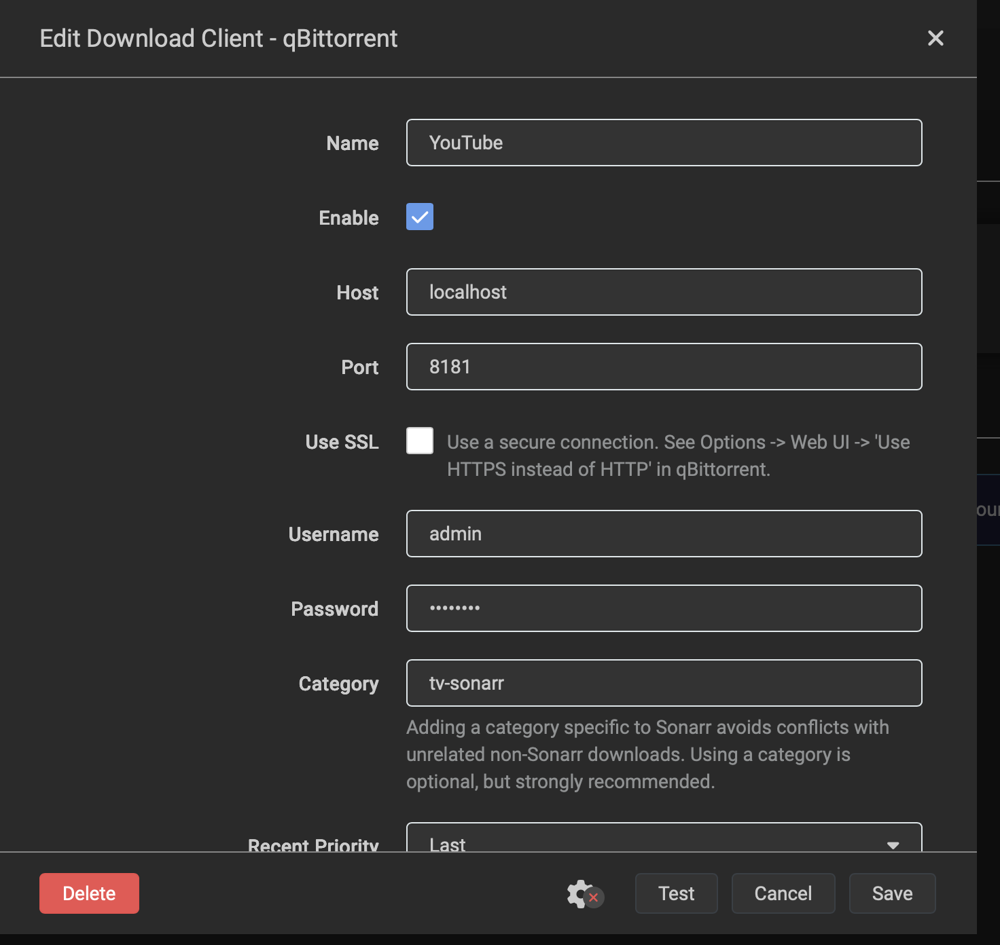

# Sonarr YouTube Download Client

**Created by Ioannis Kokkinis**

A qBittorrent-compatible API server that enables Sonarr to download YouTube content using yt-dlp.

---

## Quick Start

**1. Install & Run**
```bash
# Install yt-dlp and the PO Token provider (required for YouTube)
pip install yt-dlp bgutil-ytdlp-pot-provider

# Node.js 18+ is required for token generation
# macOS: brew install node
# Ubuntu: sudo apt install nodejs

# Run the server
python ytdl_client.py
```

**2. Add to Sonarr** (Settings → Download Clients → + → qBittorrent)

| Setting | Value |
|---------|-------|
| Host | `localhost` |
| Port | `8181` |
| Username | `admin` |
| Password | `adminadmin` |
| Category | `tv-sonarr` |



**3. Test & Save** - Click Test, then Save. Done!

**4. Add the Indexer** - You also need [sonarr-youtube-indexer](https://github.com/upggr/sonarr-youtube-indexer) for Sonarr to find YouTube videos.

---

## The Problem

Sonarr can track YouTube series (like Kurzgesagt, Veritasium, etc.) through TheTVDB metadata, but it has no way to actually download them - YouTube isn't a torrent tracker or Usenet provider.

## The Solution

This project creates a **fake qBittorrent server** that:
1. Exposes the same API that Sonarr expects from qBittorrent
2. Receives download requests from Sonarr
3. Uses `yt-dlp` to download the actual content from YouTube
4. Reports progress back to Sonarr in qBittorrent's format

**Sonarr thinks it's talking to qBittorrent, but downloads come from YouTube.**

## Features

- Full qBittorrent WebUI API v2 compatibility
- Seamless integration with Sonarr's download client system
- Real-time download progress reporting
- Automatic best quality selection (up to 1080p)
- Category support for organization
- Simple configuration

## Requirements

- Python 3.8+
- Node.js 18+ (for YouTube PO Token generation)
- yt-dlp (`pip install yt-dlp`)
- bgutil-ytdlp-pot-provider (`pip install bgutil-ytdlp-pot-provider`) - **Required for YouTube**
- ffmpeg (for merging video/audio streams)

## Installation

### Quick Start

```bash
# Clone the repository
git clone https://github.com/YOUR_USERNAME/sonarr-youtube-dl.git
cd sonarr-youtube-dl

# Install yt-dlp if not already installed
pip install yt-dlp
# or
brew install yt-dlp

# Run the server
python ytdl_client.py
```

### As a Service (macOS)

Create `~/Library/LaunchAgents/com.sonarr.youtubedl.plist`:

```xml
<?xml version="1.0" encoding="UTF-8"?>
<!DOCTYPE plist PUBLIC "-//Apple//DTD PLIST 1.0//EN" "http://www.apple.com/DTDs/PropertyList-1.0.dtd">
<plist version="1.0">
<dict>
    <key>Label</key>
    <string>com.sonarr.youtubedl</string>
    <key>ProgramArguments</key>
    <array>
        <string>/usr/bin/python3</string>
        <string>/path/to/ytdl_client.py</string>
    </array>
    <key>RunAtLoad</key>
    <true/>
    <key>KeepAlive</key>
    <true/>
    <key>StandardOutPath</key>
    <string>/tmp/sonarr-youtubedl.log</string>
    <key>StandardErrorPath</key>
    <string>/tmp/sonarr-youtubedl.log</string>
</dict>
</plist>
```

Then load it:
```bash
launchctl load ~/Library/LaunchAgents/com.sonarr.youtubedl.plist
```

### Docker

```dockerfile
FROM python:3.11-slim

RUN apt-get update && apt-get install -y ffmpeg && rm -rf /var/lib/apt/lists/*
RUN pip install yt-dlp

COPY ytdl_client.py /app/
WORKDIR /app

EXPOSE 8181

CMD ["python", "ytdl_client.py"]
```

Build and run with environment variables:
```bash
docker build -t sonarr-youtube-dl .
docker run -d -p 8181:8181 \
  -e YTDL_USERNAME=myuser \
  -e YTDL_PASSWORD=mypassword \
  -e YTDL_DOWNLOAD_PATH=/media \
  -v /path/to/media:/media \
  sonarr-youtube-dl
```

## Configuration

The application can be configured either by editing the `CONFIG` dict in `ytdl_client.py` or by setting environment variables (recommended for Docker/containerized deployments).

### Environment Variables

| Environment Variable | Default Value | Description |
|---------------------|---------------|-------------|
| `YTDL_HOST` | `0.0.0.0` | Listen address |
| `YTDL_PORT` | `8181` | Port number |
| `YTDL_USERNAME` | `admin` | Auth username |
| `YTDL_PASSWORD` | `adminadmin` | Auth password |
| `YTDL_DOWNLOAD_PATH` | `/Volumes/MEDIA/TV` | Default download location |
| `YTDL_BIN_PATH` | `yt-dlp` | Path to yt-dlp binary |
| `YTDL_LOG_LEVEL` | `INFO` | Logging level (DEBUG, INFO, WARNING, ERROR) |

Example:
```bash
export YTDL_PORT=9090
export YTDL_USERNAME=myuser
export YTDL_PASSWORD=mypassword
export YTDL_DOWNLOAD_PATH=/path/to/media/TV
python ytdl_client.py
```

### Direct Configuration

Alternatively, edit the `CONFIG` dict at the top of `ytdl_client.py`:

```python
CONFIG = {
    "host": "0.0.0.0",        # Listen address
    "port": 8181,              # Port number
    "username": "admin",       # Auth username
    "password": "adminadmin",  # Auth password
    "download_path": "/path/to/media/TV",  # Default download location
    "yt_dlp_path": "yt-dlp",  # Path to yt-dlp binary
    "log_level": "INFO",       # Logging level
}
```

## Sonarr Setup

1. Go to **Settings → Download Clients**
2. Click **+** to add a new client
3. Select **qBittorrent**
4. Configure:
   - **Name**: YouTube (or whatever you prefer)
   - **Host**: `localhost` (or your server IP)
   - **Port**: `8181`
   - **Username**: `admin`
   - **Password**: `adminadmin`
   - **Category**: `tv-sonarr`
5. Click **Test** to verify connection
6. Click **Save**

## How It Works

```
┌─────────────┐     ┌──────────────────┐     ┌─────────────┐
│   Sonarr    │────▶│  This Server     │────▶│   YouTube   │
│             │     │  (Fake qBit API) │     │   (yt-dlp)  │
└─────────────┘     └──────────────────┘     └─────────────┘
       │                     │                      │
       │  "Add torrent"      │  "Download video"    │
       │  (YouTube URL)      │                      │
       │◀────────────────────│◀─────────────────────│
       │  Progress updates   │  Video file          │
```

1. **Sonarr finds an episode** - Through Prowlarr or manual search, Sonarr gets a YouTube URL
2. **Sonarr sends to "qBittorrent"** - Sonarr POSTs the URL to our fake qBittorrent API
3. **We download with yt-dlp** - The server spawns yt-dlp to download the video
4. **Progress is reported** - Sonarr polls for status, we return qBittorrent-formatted responses
5. **Download completes** - Sonarr sees it as "seeding" and imports the file

## Indexer Setup

For this to work automatically, you need an indexer that returns YouTube URLs. Options:

1. **Manual Search** - Search YouTube manually, copy the URL, and use Sonarr's manual import
2. **Custom Indexer** - Create a Prowlarr indexer that searches YouTube
3. **Cardigann Definition** - Write a YAML definition for YouTube search

Example Prowlarr custom definition (work in progress):
```yaml
# youtube.yml - Place in Prowlarr's Definitions/Custom folder
```

## Limitations

- **No automatic episode matching** - YouTube doesn't have standardized episode naming, so matching relies on TheTVDB metadata accuracy
- **Rate limiting** - YouTube may rate-limit or block excessive requests
- **Quality selection** - Currently defaults to best quality up to 1080p
- **No seeding** - Obviously, there's no seeding to YouTube

## Troubleshooting

### "Connection refused" in Sonarr
- Ensure the server is running: `python ytdl_client.py`
- Check the port isn't blocked by firewall
- Verify the host/port in Sonarr settings

### Downloads stuck at 0%
- Check yt-dlp is installed: `yt-dlp --version`
- Check ffmpeg is installed: `ffmpeg -version`
- Look at the server logs for errors

### "Video unavailable"
- The video may be geo-restricted, age-restricted, or deleted
- Try adding cookies: modify yt-dlp command to use `--cookies-from-browser`

## Contributing

Contributions welcome! Areas that need work:

- [ ] Prowlarr YouTube indexer definition
- [ ] Web UI for status monitoring
- [ ] Cookie/authentication support for age-restricted content
- [ ] Quality selection options
- [ ] Subtitle download support
- [ ] Playlist handling

## License

MIT License - Use freely, contribute back if you can!

## Credits

- [yt-dlp](https://github.com/yt-dlp/yt-dlp) - The actual downloading engine
- [Sonarr](https://sonarr.tv/) - The PVR that makes media management sane
- [qBittorrent](https://www.qbittorrent.org/) - API design we're mimicking

## Disclaimer

This tool is for personal use with content you have the right to download. Respect YouTube's Terms of Service and content creators' rights.
